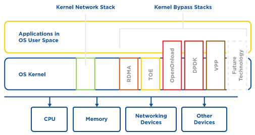
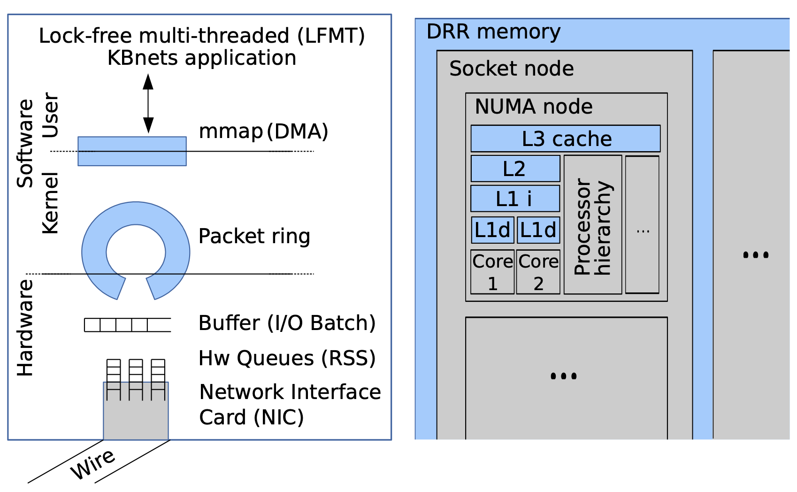
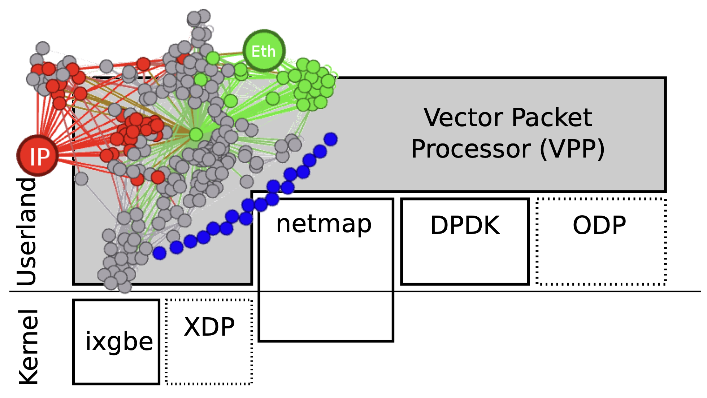

## Intro

Cisco Meraki employs [the Click Modular Router](https://read.seas.harvard.edu/~kohler/pubs/phdthesis.pdf) to implement network functions on their firmwares, including wireless access points (MR), switches (MS), and gateways (MX). It is a very nice modularized implementation in C++. However, when comparing with Vector Packet Processing (VPP), it has lower performance in terms of both throughput and latency. I recently randomly hit this [paper](https://perso.telecom-paristech.fr/drossi/paper/vpp-bench-techrep.pdf) that very well explained and benchmarked VPP. One of the authors is my colleague in Cisco Meraki by the time this blog is written. (Gossip: though we also notice there are authors from Huawei as well, it does not signify that Cisco and Huawei are strong allies here ;)

Without further ado, let's take a closer look at how VPP made it effectively faster than Click. 

## KBnets Techniques

The secret lies in the fact that VPP implemented many kernel-bypassing techniques. The networks that implement high-speed stacks bypassing operatin system kernels are called `KBnets` here. From the figure above (source [here](https://www.netronome.com/blog/avoid-kernel-bypass-in-your-network-infrastructure/)), we can see that there are multiple techniques that bypass kernel stack. The reason in behind is that user-space applications typically need to perform sys-calls which rely on the kernel as an intermediate step to access hardware device. Crossing the border between user-space and kernel-space can add additional overhead.

To better explain in details what are the techniques that VPP uses as a KBnet util, let's dig deeper into the common off-the-shelf (COTS) hardware architecture (Intel Core i7 CPU) depicted below.

### Lock-Free Multi-Threading (LFMT)

With the advance of modern CPU and computer architecture, there is a natural tendency towards using multiple cores and multi-thread programming paradigm. To further boost the performance, it is imperative to avoid performance issues tied to the use of mutex and so to achieve lock-free operation.

### Low-Level Parallelism

To exploit the underlying CPU pipeline micro-structure, vectorized processing prefetch a shared instruction that can be applied to a batch of network packets, to maintain the pipeline fully running and therefore improve the throughput.

### Cache Coherence & Locality (CC&L)

As depicted in the figure above, each NUMA node contains a hierarchical orgaization of caches:
- L1 Cache: access time 1ns, shared instruction and data, per-core/process
- L2 Cache: access time 10ns, per-core or shared among multiple cores
- L3 Cache: access time 60ns, shared within a NUMA node
Reducing cache-misses can effectively accelerate the process.

### Zero Copy (DMA)

Zero-copy can be achieved when user-space application has direct memory access (DMA) and consumes faster than the packet arrival rate.

### RSS Queues

Receiver-side scaling (RSS) queues are accessible in user-space and help maintain the network flow table (_e.g._ identified by 5-tuple) from hardware.

### I/O Batching

To optimize for CC&L and low-level CPU pipeline, and reduce interrupts as much as possible, packets are classified and buffered in different ring-buffers (accessible by both NIC and user-space application). No interrupt is raised until the ring-buffer is full.

## VPP Architecture

- VPP is written in C
- Sources are organized into 2 groups
    - low-level libs
    - high-level plugins
- A forwarding graph is composed by the main code and plugins to describe the possible paths a packet can traverse during its lifecycle.
- VPP is NUMA-aware and cache-aware
- A list of techniques that VPP employs to accelerate the processing
    - vectorized processing
    - multi-loop (loop unrolling)
    - branch prediction
    - function flattening (inline functions)
    - direct cache access (DCA)
    - multi-architecture support

## Benchmark

Detailed experimental evaluation using various hyperparameters can be found in [this paper](https://perso.telecom-paristech.fr/drossi/paper/vpp-bench-techrep.pdf) and a thorough comparison and benchmark can be found in [this paper](https://www.sciencedirect.com/science/article/abs/pii/S1389128621000372?fr=RR-2&ref=pdf_download&rr=854cd68e5dbd9440).